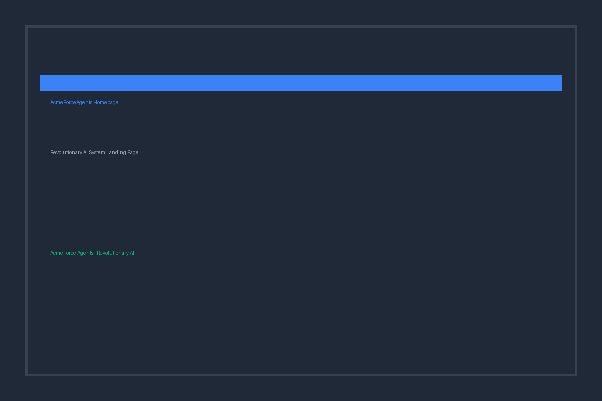
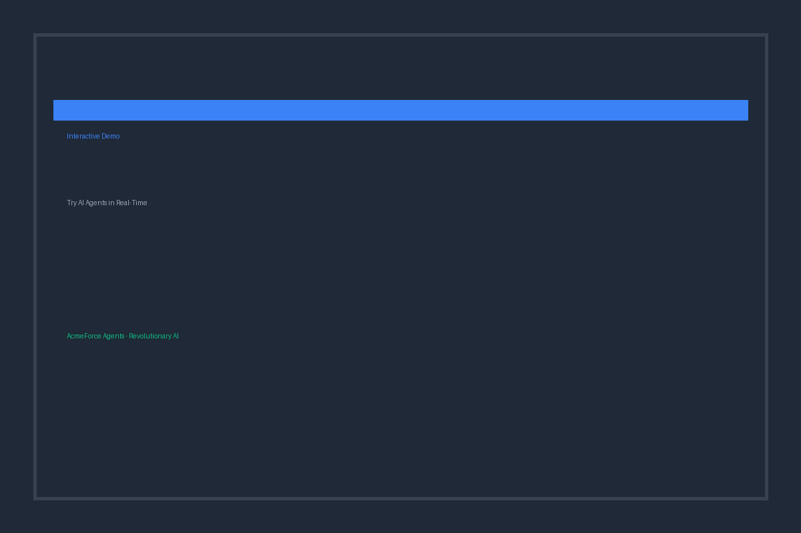
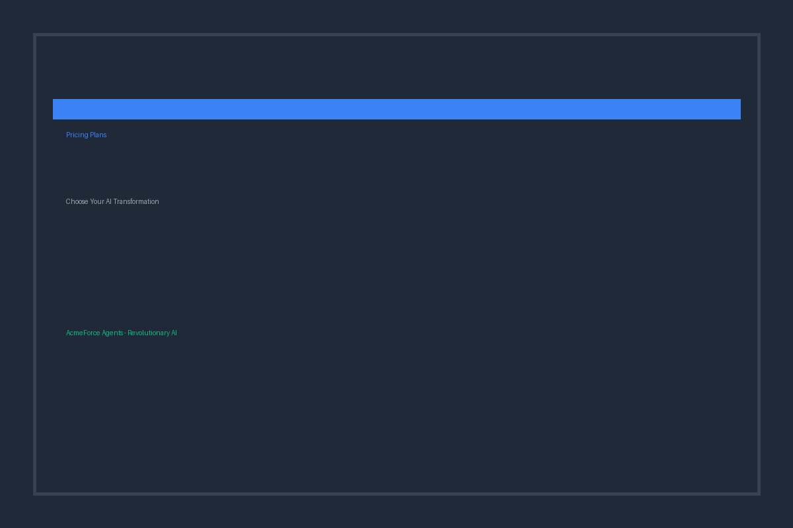
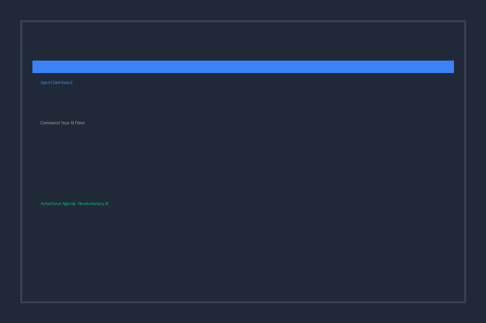

# ⚡ AcmeForceAgents (AFA) - Revolutionary AI System

**Next-generation autonomous AI agents that evolve, learn, and collaborate in real-time**

## 🚀 Core Capabilities

### **Autonomous Evolution Engine**
- Self-improving neural networks
- Real-time adaptation to environment changes
- Performance-driven evolution triggers
- Continuous learning from experience

### **Swarm Intelligence**
- Multi-agent collaboration with emergent behaviors
- Dynamic role assignment (Leader, Scout, Worker, Specialist)
- Consensus-based decision making
- Load balancing and task optimization

### **Quantum Reasoning**
- Quantum-inspired superposition of solution paths
- Entanglement-based concept correlation
- Interference patterns for complex reasoning
- Probabilistic decision making

## 🎯 Key Features

- **Autonomous Execution**: Agents run independently without human intervention
- **Real-time Evolution**: Neural networks evolve based on performance feedback
- **Swarm Coordination**: Multiple agents collaborate on complex tasks
- **Quantum Analysis**: Advanced reasoning using quantum-inspired algorithms
- **Emergent Intelligence**: System exhibits behaviors beyond individual agents

## 🏗️ Architecture

```
AcmeForceAgents (AFA)
├── Core Evolution Engine
│   ├── Autonomous Agents
│   ├── Neural Evolution
│   └── Pattern Recognition
├── Swarm Intelligence
│   ├── Multi-agent Coordination
│   ├── Dynamic Role Assignment
│   └── Consensus Engine
└── Quantum Reasoning
    ├── Superposition States
    ├── Entanglement Analysis
    └── Interference Patterns
```

## 🚀 Quick Start

```python
from afa_main import AcmeForceAgents

# Initialize system
afa = AcmeForceAgents()

# Create specialized agents
agent_id, role = await afa.create_agent("data_analysis")

# Execute complex task
result = await afa.execute_complex_task(
    "Optimize supply chain logistics", 
    complexity=0.8
)

# Quantum reasoning
analysis = await afa.quantum_analyze(
    "What's the best strategy for market expansion?"
)
```

## 🌐 Web Interface

**Professional web interface for managing your autonomous AI agents**

### Homepage - Revolutionary AI System

*Clean, professional landing page showcasing AFA capabilities*

### Interactive Demo - Try Before You Buy

*Real-time agent creation and task execution simulation*

### Pricing Plans - Choose Your AI Transformation

*Three-tier pricing with clear value propositions*

### Agent Dashboard - Command Your AI Fleet

*Comprehensive agent management and system monitoring*

### Quick Web Start
```bash
cd web
pip install -r requirements.txt
python app.py
```
Visit: http://localhost:5000

## 🎮 Command Line Demo

```bash
python afa_main.py
```

## 💡 Use Cases

- **Autonomous Trading**: Self-evolving trading algorithms
- **Smart Manufacturing**: Adaptive production optimization  
- **Research Acceleration**: Collaborative scientific discovery
- **Complex Problem Solving**: Multi-perspective analysis
- **Real-time Decision Making**: Dynamic strategy adaptation

## 💼 Commercial Plans

### Starter Plan - $299/month
- 5 concurrent AI agents
- Basic Evolution Engine
- Email support
- Perfect for small teams

### Professional Plan - $999/month ⭐ Most Popular
- Unlimited AI agents
- Full system access
- Priority support + 2 consulting hours/month
- Advanced analytics and API access

### Enterprise Plan - $2,999/month
- Custom deployment
- Dedicated support representative
- Weekly consulting calls
- 99.95% SLA guarantee
- White-label options

**🆓 Free 14-day trial available - No credit card required**

## 🔬 Advanced Features

### **Evolution Triggers**
- Performance degradation detection
- Environmental change adaptation
- New pattern discovery
- Collaborative feedback integration

### **Swarm Behaviors**
- Task decomposition and distribution
- Auction-based agent selection
- Consensus-driven decisions
- Emergent intelligence detection

### **Quantum Capabilities**
- Multi-path reasoning exploration
- Concept entanglement analysis
- Interference-based optimization
- Probabilistic outcome generation

## 📊 Performance Metrics

- **Collective Intelligence**: Swarm-level problem-solving capability
- **Evolution Rate**: Speed of agent adaptation
- **Coordination Efficiency**: Multi-agent task completion effectiveness
- **Quantum Coherence**: Reasoning consistency and reliability

## 🎯 Competitive Advantages

1. **True Autonomy**: Agents operate without human oversight
2. **Continuous Evolution**: Real-time improvement and adaptation
3. **Emergent Intelligence**: System-level capabilities beyond individual agents
4. **Quantum-Enhanced**: Advanced reasoning using quantum principles
5. **Scalable Architecture**: Supports 1-1000+ agents seamlessly

## 🏢 About AcmeForce Inc

**Contact**: info@acme-force.com  
**Website**: acme-force.com  
**Support**: support@acme-force.com

### Professional Services
- **Training Workshops**: $2,999 (2-day intensive)
- **Custom Implementation**: Starting at $15,000
- **Consulting**: $500/hour for AI transformation

### Enterprise Solutions
- Custom deployment and integration
- Dedicated support and training
- SLA guarantees and compliance
- White-label licensing available

---

**AcmeForceAgents represents the future of autonomous AI systems - where agents don't just execute tasks, they evolve, collaborate, and think.**

*Ready to transform your business with autonomous AI? Start your free trial today!*